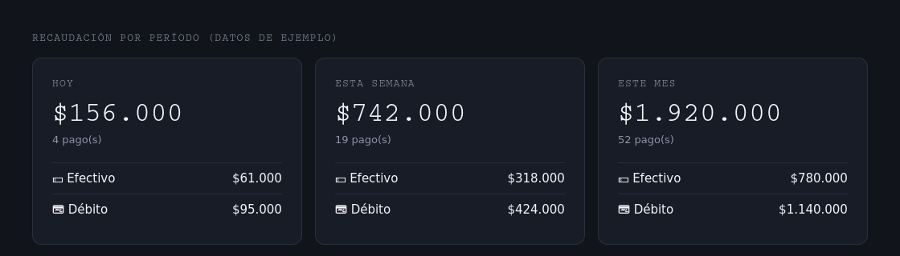
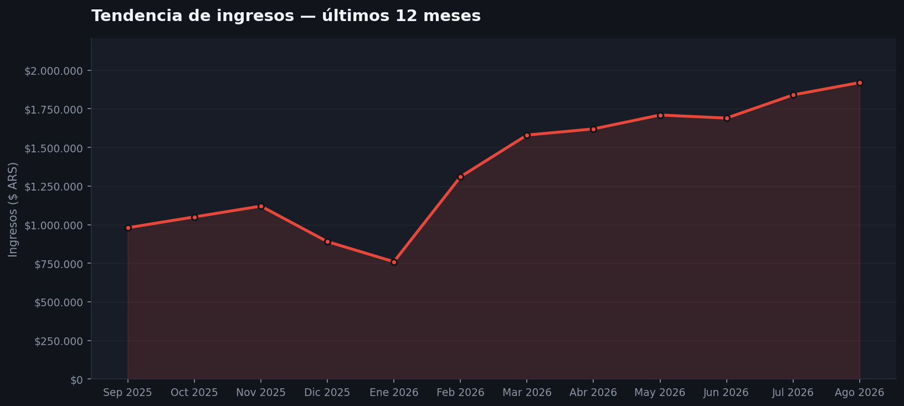
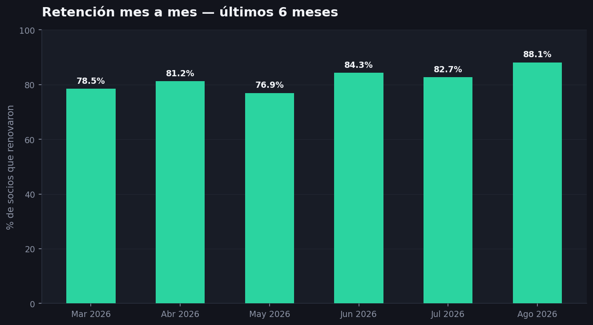
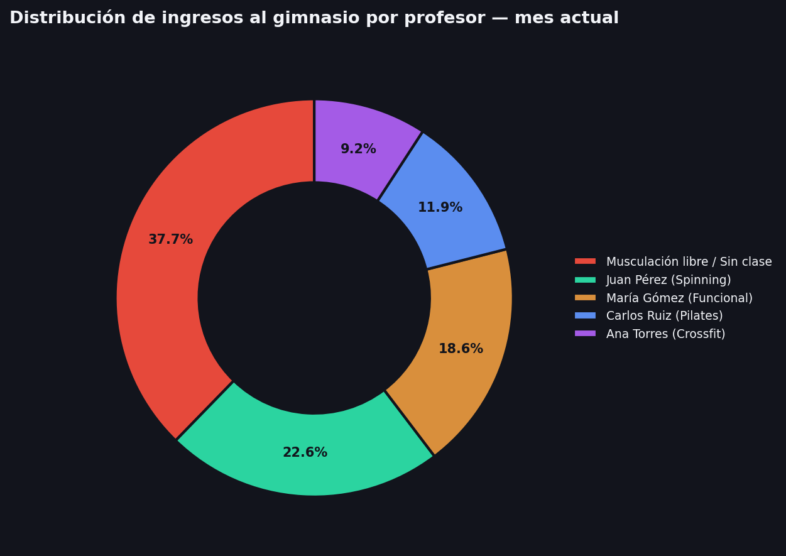

# Sistema de Gestión de Socios — Gimnasio

Sistema web completo para la gestión diaria de un gimnasio: control de acceso por DNI, membresías con vencimiento personalizado por socio, gestión de pagos, clases con profesores, y un dashboard de Business Intelligence con métricas de ingresos y retención.

## El problema

Un gimnasio de barrio llevaba el control de socios y pagos en papel y planillas de Excel sueltas. No había forma rápida de saber, al momento en que alguien entraba por la puerta, si tenía la cuota al día — y mucho menos entender tendencias de ingresos o qué profesores concentraban más asistencia.

## La solución

Un sistema web accesible desde cualquier dispositivo, pensado para que la persona en recepción escriba un DNI y en segundos sepa: quién es, si puede entrenar, y deje registro del ingreso — todo alimentando después un dashboard analítico para la toma de decisiones del dueño del gimnasio.

---

## Funcionalidades

- **Control de acceso por DNI**: búsqueda instantánea del estado de membresía, con registro automático de cada ingreso.
- **Vencimientos personalizados**: cada socio tiene su propio "día ancla" de vencimiento (fijado al momento del alta), independiente de cuándo pague cada mes — la deuda nunca "corre" el día de vencimiento real.
- **Gestión de pagos**: múltiples métodos de pago (efectivo/débito), historial completo por socio, cálculo automático de vencimiento al registrar cada pago.
- **Administración de clases y profesores**: horarios de clases vinculados a profesores, con asignación automática de cada check-in a la clase en curso según el horario (sin pasos extra para quien opera el sistema).
- **Dashboard de Business Intelligence**:
  - Recaudación por período (hoy / semana / mes), desglosada por método de pago.
  - Tendencia de ingresos de los últimos 12 meses (gráfico de línea).
  - Tasa de retención mes a mes (% de socios que renuevan).
  - Distribución de asistencia por profesor (gráfico de torta), con filtro de período configurable.
  - Exportación a Excel de pagos por mes.
- **Alertas de vencimiento**: listado de socios vencidos y próximos a vencer, configurable por rango de días.
- **Autenticación y seguridad**: login con contraseñas hasheadas (scrypt), límite de intentos fallidos, cookies de sesión endurecidas.
- **Tests automatizados**: suite de tests con `pytest` corriendo en CI (GitHub Actions) en cada push, contra una base de datos de test aislada.
- **Arquitectura multi-tenant**: un mismo despliegue soporta múltiples gimnasios de forma completamente aislada — cada usuario de personal pertenece a un gimnasio específico, y todos los datos (socios, pagos, asistencias, precios, profesores, clases, reportes) quedan filtrados automáticamente sin posibilidad de fuga entre clientes. El aislamiento está cubierto por una suite de tests automatizados dedicada (fugas de lectura, de escritura, y colisión de claves entre gimnasios), no solo verificado manualmente.

---
## Imagenes relevantes para BI
**Resumen de recaudación por período**


**Tendencia de ingresos**


**Retención de socios mes a mes**


**Distribución de asistencia por profesor**


*Nota: capturas generadas con datos ficticios para preservar la privacidad de los socios reales del gimnasio.*

## Arquitectura y stack

| Capa | Tecnología |
|---|---|
| Backend | Python 3 + Flask |
| Base de datos | MySQL (alojada en Aiven, plan gratuito) |
| Frontend | HTML + Jinja2 + CSS (sin frameworks) + Chart.js para visualizaciones |
| Hosting | Render (plan gratuito) |
| CI/CD | GitHub Actions |
| Testing | pytest |

### Por qué estas decisiones

- **Flask sobre Django**: para un sistema de este alcance, la simplicidad y el control explícito de Flask permitieron iterar rápido sin la sobrecarga de un framework más opinionado.
- **MySQL en Aiven, no en el mismo proveedor de hosting**: separar la base de datos del servidor de aplicación evita quedar atado a un solo proveedor y facilita escalar cada componente de forma independiente.
- **Connection pooling**: las consultas iniciales abrían una conexión nueva a la base por cada request, generando latencias perceptibles (~1s) en cada acción. Se resolvió implementando un pool de conexiones reutilizables, reduciendo la latencia percibida de forma notable.
- **Sin ORM**: se usó SQL directo con parámetros preparados (`%s`) en lugar de un ORM como SQLAlchemy, priorizando control total sobre las queries y evitando una capa de abstracción innecesaria para el tamaño del proyecto.

---

## Desafíos técnicos resueltos (algunos highlights)

**1. Migración forzada de proveedor a mitad de proyecto**
El plan gratuito de PythonAnywhere eliminó el soporte a MySQL después de haber empezado el despliegue ahí. Esto obligó a evaluar alternativas (PythonAnywhere de pago, Vercel + Supabase con Postgres, Render + Aiven) bajo la restricción de mantener costo cero, resultando en la migración a Render + Aiven sin cambiar el motor de base de datos ni reescribir las queries existentes.

**2. Bug de zona horaria en producción**
Los pagos registrados después de las 21:00 hs (horario Argentina) aparecían con la fecha del día siguiente en los reportes. Causa: el servidor en la nube corre en UTC por defecto, y Argentina está 3 horas detrás — entre las 21:00 y medianoche hora local, el servidor ya "cree" que es el día siguiente. Se resolvió fijando la variable de entorno `TZ=America/Argentina/Buenos_Aires` en el entorno de producción, sin necesidad de tocar código.

**3. Resiliencia ante caídas de la base de datos**
Al implementar el pool de conexiones, un fallo transitorio de la base (por ejemplo, cuando el plan gratuito de Aiven "duerme" la base por inactividad) tiraba abajo el proceso completo del servidor, no solo la request afectada. Se resolvió con inicialización perezosa (lazy) del pool y reintentos automáticos con backoff, evitando que una caída temporal de la base derribe todo el servicio.

**4. Diseño de vencimientos con "día ancla" fijo**
El requerimiento de negocio era que la fecha de vencimiento de cada socio quedara fija en el día del mes en que se dio de alta (ej: día 10), independientemente de qué día del mes pagara cada vez. Se resolvió separando el concepto de "día ancla" (fijo, guardado por socio) del cálculo de "próxima fecha de vencimiento" (recalculado en cada pago, siempre anclado a ese día, con ajuste automático para meses con menos días — ej: 31 en febrero).

**5. Migración a arquitectura multi-tenant sin downtime**
El sistema fue diseñado originalmente para un único gimnasio, con `dni` como clave primaria de la tabla de socios. Migrar a soporte multi-cliente requirió: (a) rediseñar la clave primaria como compuesta (`dni` + `id_gimnasio`), permitiendo que el mismo DNI exista en distintos gimnasios sin colisión; (b) propagar el filtro de aislamiento a más de 20 consultas SQL a lo largo de todo el backend; y (c) migrar los datos existentes con `ALTER TABLE ... DEFAULT` para no perder ningún registro histórico durante la transición. La validación se hizo con un caso de prueba deliberado (mismo DNI en dos gimnasios), que expuso dos fugas de aislamiento en consultas que agregaban datos (`COUNT`, historial de pagos) en lugar de filtrar directamente por socio — un recordatorio de que las consultas de agregación necesitan la misma disciplina de filtrado que las de búsqueda directa. Ese mismo patrón de fuga se replicó, de forma más sutil, en el testing: fue necesario recrear el esquema completo en la base de datos de test para que los tests de aislamiento pudieran ejecutarse, evidenciando que mantener paridad de esquema entre entornos es tan crítico como el propio código de la aplicación.

---

## Modelo de datos
USUARIO ──┬── PAGO ──── PRECIO (historial de precios, no se sobreescriben)
├── ASISTENCIA ──── CLASE ──── PROFESOR

Decisión de diseño destacable: en lugar de sobreescribir el precio de un plan al modificarlo, se crea un nuevo registro y se desactiva el anterior (`activo = FALSE`) — así los pagos históricos siempre reflejan el precio real que se cobró en su momento, sin perder trazabilidad.

---

## Cómo correrlo localmente

```bash
git clone https://github.com/marchedev2002/gimnasio-app.git
cd gimnasio-app
pip install -r requirements.txt

# Definir variables de entorno (ver .env.example)
export DB_HOST=tu-host
export DB_PORT=tu-puerto
export DB_USER=tu-usuario
export DB_PASSWORD=tu-password
export DB_NAME=tu-base
export SECRET_KEY=una-clave-secreta

python app.py
```

## Correr los tests

```bash
pip install pytest
# Definir variables de entorno apuntando a una base de datos de TEST separada
pytest
```

La suite incluye tests unitarios (cálculo de vencimientos), de integración (flujo de alta/edición de socios) y de aislamiento multi-tenant — estos últimos verifican específicamente que no haya fugas de datos entre gimnasios distintos: colisión de claves con el mismo DNI, intentos de lectura y escritura cruzada, y consistencia de contadores agregados (dashboard).

---

## Roadmap

- [ ] Notificaciones automáticas de vencimiento por email
- [ ] Roles de usuario diferenciados (recepción vs. administración)
- [ ] Auditoría de acciones (logs de quién hizo qué)

---

## Autor

Valentin Marchese — marchese52002@gmail.com

Proyecto desarrollado end-to-end: diseño de base de datos, backend, frontend, despliegue en la nube, CI/CD y observabilidad.